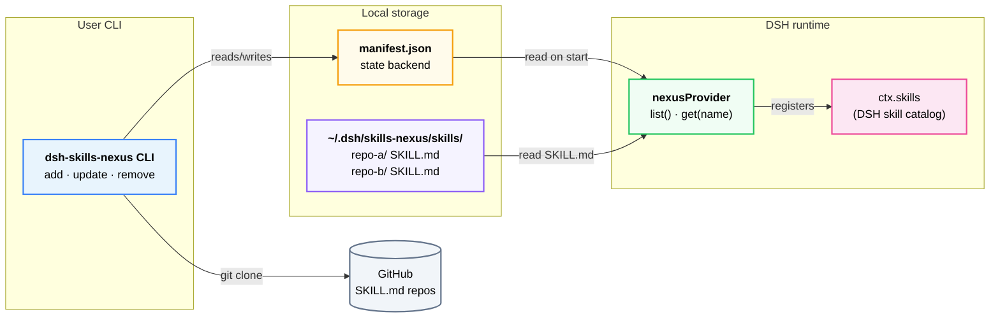

# dsh-skills-nexus

A universal DSH skill adapter. Install **once**, then register **any** GitHub
repo that contains a `SKILL.md` as a DSH skill — one command at a time. The
skill repo itself stays pure: no Cordis plugin code, no `package.json`, no
`cordis.patch.yml` required.

This generalizes the "thin wrapper" pattern from a single hardcoded skill to
**N dynamically discovered skills** — one provider carries many skills,
discovered and registered at runtime by scanning directories.

## Architecture overview



- **CLI writes**: `add` / `update` / `remove` commands operate git and update `manifest.json`
- **Provider reads**: `list()` scans all cloned dirs on DSH start; `get()` returns skill body
- **Decoupled**: CLI and provider communicate through manifest.json, no direct dependency

## Why

`dsh plugin --profile <name> add "github:owner/repo"` forwards to pnpm and
**only activates packages that declare `dsh.bundle.patch`**. A repo that is just
`SKILL.md` + `references/` + `scripts/` has no Cordis wrapper, so it cannot be
installed that way. `dsh-skills-nexus` fills that gap:

| command | installs | requires `dsh.bundle.patch`? |
|---|---|---|
| `dsh plugin add github:owner/dsh-skills-nexus` | the nexus itself (once) | yes |
| `dsh-skills-nexus add github:owner/any-skill` | pure SKILL.md content | **no** |

## Install the nexus

```bash
dsh plugin --profile web add "github:xiaxi626/dsh-skills-nexus"
```

Restart the profile once. From now on the nexus provider is active in
`ctx.skills`. The compiled `lib/` is shipped with the repo — no build needed.

## Usage

```bash
# register a skill repo (cloned under ~/.dsh/skills-nexus/skills/<name>/)
dsh-skills-nexus add github:owner/repo
dsh-skills-nexus add github:owner/repo#dev          # pick a branch/tag
dsh-skills-nexus add https://github.com/owner/repo
dsh-skills-nexus add owner/repo                     # shorthand

# inspect / maintain
dsh-skills-nexus list                               # all registered skills
dsh-skills-nexus update [name]                      # git pull (all, or one)
dsh-skills-nexus enable  <name>                     # show in catalog (default)
dsh-skills-nexus disable <name>                     # hide without deleting
dsh-skills-nexus remove <name>                      # delete clone + unregister
```

Accepted repo forms: `github:owner/repo[#ref]`, full `https://` URL (incl.
`/tree/<ref>/...` subpaths), `git+https://`, `git@`/`ssh://`, and bare
`owner/repo` shorthand.

## SKILL.md discovery (per cloned repo)

1. `<repoRoot>/SKILL.md` — authoritative; repo treated as a single skill.
2. `<repoRoot>/<name>/SKILL.md` — repo bundles one skill per subdirectory (single-level only, matching the official filesystem provider; nested `**/SKILL.md` is excluded).
3. `<repoRoot>/<name>.md` — flat markdown (no bundled resources).

`README.md` / `CHANGELOG.md` / `LICENSE.md` are skipped in the flat scan.

### Frontmatter fields honored

Required: `name`, `description`. Optional, respected by the provider:
`disable-model-invocation` (bool), `user-invocable` (bool). Any other fields
(`whenToUse`, `metadata`, …) are parsed and available but not interpreted by
the nexus.

## Filesystem layout

```
~/.dsh/skills-nexus/
├── manifest.json          # state backend (CLI writes, provider reads)
└── skills/
    ├── repo-a/            # full git clones, untouched
    │   ├── SKILL.md
    │   └── references/…
    └── repo-b/
```

Override the root with `DSH_HOME` (defaults to `~/.dsh`) or
`DSH_SKILLS_NEXUS_HOME` (defaults to `<DSH_HOME>/skills-nexus`).

## Uninstall

There are two levels of uninstall — pick whichever fits:

### Remove individual skills

```bash
# list what you have
dsh-skills-nexus list

# remove one (deletes the clone and unregisters it)
dsh-skills-nexus remove <skill-name>
```

The skill disappears from the DSH catalog on the next reload. All other
registered skills are unaffected.

### Uninstall the nexus itself

```bash
# 1. (optional) remove all managed skills first — cleans up ~/.dsh/skills-nexus/
dsh-skills-nexus list | awk 'NR>1 && $2 {print $2}' | xargs -I{} dsh-skills-nexus remove {}

# 2. uninstall the plugin from your DSH profile
dsh plugin --profile web remove dsh-skills-nexus

# 3. (optional) delete any leftover state
rm -rf ~/.dsh/skills-nexus
```

Restart the DSH profile. The `dsh-skills-nexus` provider and all its skills
will be gone.

## Local testing steps

You can fully test the nexus on your machine without pushing to GitHub or
publishing to npm. Follow these five steps.

### Step 1 — build the project

Inside the `dsh-skills-nexus/` directory:

```bash
cd dsh-skills-nexus
npm install
npm run build      # generates lib/
```

> If you've made changes and want to verify types before building, run
> `npm run typecheck` (type-check only, no output).

### Step 2 — create a local overlay

Create `overlay.yml` in the project root (**do NOT commit this to git** — it's
for local development only):

```yaml
# overlay.yml
- insert:
    - id: dsh-skills-nexus
      # Windows: '/C:/your/path/dsh-skills-nexus/lib/index.js'
      # macOS:   '/Users/your/path/dsh-skills-nexus/lib/index.js'
      # Linux:   '/home/your/path/dsh-skills-nexus/lib/index.js'
      name: '/your/absolute/path/dsh-skills-nexus/lib/index.js'
```

> Replace `name` with the **absolute path** to `lib/index.js` on your machine.
> Windows **must** prepend `/` before the drive letter, e.g. `'/C:/dev/dsh-skills-nexus/lib/index.js'`; macOS / Linux uses the absolute path directly, e.g. `'/home/user/dsh-skills-nexus/lib/index.js'`.

**Or generate it with a one-liner** (make sure you've cd'd into the project directory):

**Windows (Git Bash / MINGW):**

```bash
cat > overlay.yml <<EOF
- insert:
    - id: dsh-skills-nexus
      name: '/$(pwd -W)/lib/index.js'
EOF
```

> `pwd -W` outputs a Windows-style absolute path (e.g. `C:/Users/xxx/dsh-skills-nexus`); the leading `/` **must** be prepended, resulting in `/C:/Users/xxx/dsh-skills-nexus/lib/index.js`.
> Node.js ESM loader on Windows does not accept a bare `C:/...` path (it treats `C:` as a URL scheme), so you must write `/C:/...` or `file:///C:/...`.

**macOS / Linux:**

```bash
cat > overlay.yml <<EOF
- insert:
    - id: dsh-skills-nexus
      name: '$(pwd)/lib/index.js'
EOF
```

> `pwd` outputs a Unix-style absolute path (e.g. `/Users/xxx/dsh-skills-nexus`) — it already starts with `/`, resulting in `/Users/xxx/dsh-skills-nexus/lib/index.js`. No extra leading `/` needed.

This creates `overlay.yml` at the project root with the correct path auto-filled.

### Step 3 — start DSH in patch mode

```bash
npx @deepseek-ai/dsh web --patch overlay.yml
```

This mounts the nexus as a temporary layer in the current profile, so the
provider gets registered. **After each code change, run `npm run build` and
restart DSH for changes to take effect.**

### Step 4 — add a skill with the CLI

> **Important:** do **not** move the project folder during local testing. If you
> move it after `npm link`, running `npm link` again will fail with
> `EEXIST: file already exists` because the old symlink is still registered
> globally. See the fix below.

Open another terminal:

```bash
# link the CLI globally so you can type `dsh-skills-nexus` directly
cd dsh-skills-nexus
npm link

# add a real skill repo to test with
dsh-skills-nexus add github:xiaxi626/theme-port-skill

# verify it was registered
dsh-skills-nexus list
```

**If you moved the folder and `npm link` fails with EEXIST:**

```bash
# remove the stale global links (Git Bash on Windows)
rm -f ~/AppData/Roaming/npm/dsh-skills-nexus
rm -f ~/AppData/Roaming/npm/dsh-skills-nexus.cmd

# then re-link
npm link
```

> The paths above are for Windows + Git Bash. On macOS or Linux, global links
> are usually under `/usr/local/bin/`.

### Step 5 — verify inside DSH

> **Important**: the DSH process started in Step 3 with `--patch` was launched
> **before** you added the skill in Step 4, so simply asking "what skills do you
> have" in the existing DSH session won't show the new skill — the provider
> hasn't loaded it yet.
>
> **You must stop and restart it**: go back to the terminal where DSH is running
> (Step 3), press `Ctrl+C` to stop the process, then re-run the same command:
> ```bash
> npx @deepseek-ai/dsh web --patch overlay.yml
> ```
> On restart, DSH reloads the provider and `list()` picks up the skill you just
> added via the CLI.

After restarting, go into the DSH session and ask something like "what skills do
you have" to trigger the skill catalog. Check that `theme-port-skill` appears in
the list.

---

## Lighter check (core logic, no DSH needed)

If you only want to verify the "clone + parse + provider list/get" pipeline
without running the full DSH, you can write a short Node script that calls the
provider directly:

```js
// test-provider.mjs
import { nexusProvider } from './lib/provider.js'

const list = await nexusProvider.list()
console.log('list:', list.map(s => s.name))

const skill = await nexusProvider.get('theme-port-skill')
console.log('get:', skill.description.slice(0, 60))
console.log('content length:', skill.content.length)
```

```bash
node test-provider.mjs
```

> Prerequisite: you've already added at least one skill with `dsh-skills-nexus add`.
> If `list()` returns the expected skill and `get()` returns the body, the
> entire thin-wrapper seam is working.

---

## How it works

```
dsh-skills-nexus add github:owner/repo
   └─ git clone --depth 1 →  ~/.dsh/skills-nexus/skills/<name>/
   └─ append entry          →  ~/.dsh/skills-nexus/manifest.json

DSH starts / reloads
   └─ apply(ctx) → ctx.skills.registerProvider(() => nexusProvider)
        └─ list()   reads manifest, scans each clone, returns SkillCandidate[]
        └─ get(name) reads SKILL.md, returns { content: body, resourceBase }
```

The provider implements the standard thin-wrapper seam:

- `list()` returns an **array** of `SkillCandidate` — one provider carries many skills.
- `parseFrontmatter()` reads `SKILL.md` at runtime (no duplicate description in code); uses the `yaml` package like the official `dsh-skill-filesystem`.
- `resourceBase` is built **per skill** and points at that skill's own clone directory, so relative paths (`references/`, `scripts/`, `assets/`) resolve correctly.
- The skill name is taken from each `SKILL.md`'s frontmatter `name` (falling back to the manifest key), so multi-skill repos surface correctly.

## Project layout

```
src/
├── index.ts          # Cordis plugin entry: apply(ctx) → registerProvider
├── provider.ts       # nexusProvider: list() / get(name)
├── resolve.ts        # manifest entries → parsed skills
├── manifest.ts       # read/write/find/add/remove/toggle manifest.json
├── locator.ts        # locate SKILL.md inside a clone (3 discovery layouts)
├── frontmatter.ts    # yaml-based frontmatter + body parser
├── git.ts            # parseGitSpec / cloneRepo / pullRepo (execFile, no shell)
├── paths.ts          # home/skills/manifest path constants
├── types.ts          # Manifest / SkillCandidate / SkillDefinition / Context
└── cli/
    ├── index.ts      # dispatcher
    ├── args.ts       # tiny argv parser
    └── commands/     # add · list · update · remove · toggle
```

Runtime dependency is just `yaml`. `@deepseek-ai/cordis` and
`@deepseek-ai/dsh-skill` are optional peer deps (the SDK provides the real
`Context` at runtime; the local structural types in `types.ts` keep the project
typecheckable without them).

## Notes & limitations

- **`add` then visibility**: whether a newly added skill appears immediately in
  the catalog depends on whether DSH caches provider `list()` results. If the
  profile was started before `add`, reload it (or rely on the nexus's read-on-
  every-`list` design, which picks up changes on the next catalog refresh).
- **Default branch detection**: when no `#ref` is given, the CLI detects the
  remote's default branch via `git ls-remote --symref` (falls back to `main`).
  Pin a ref with `#branch`, `#tag`, or `#commit-sha` to override.
- **Skill content repos only**: this is *not* a replacement for `dsh plugin add`
  of real Cordis plugins. If a repo already ships a `dsh.bundle.patch`, install
  it the normal way — nexus is for repos that don't.
- **Build scripts**: because nexus clones content repos itself (not via pnpm),
  it sidesteps pnpm `allowBuilds` interception entirely.

## License

MIT
