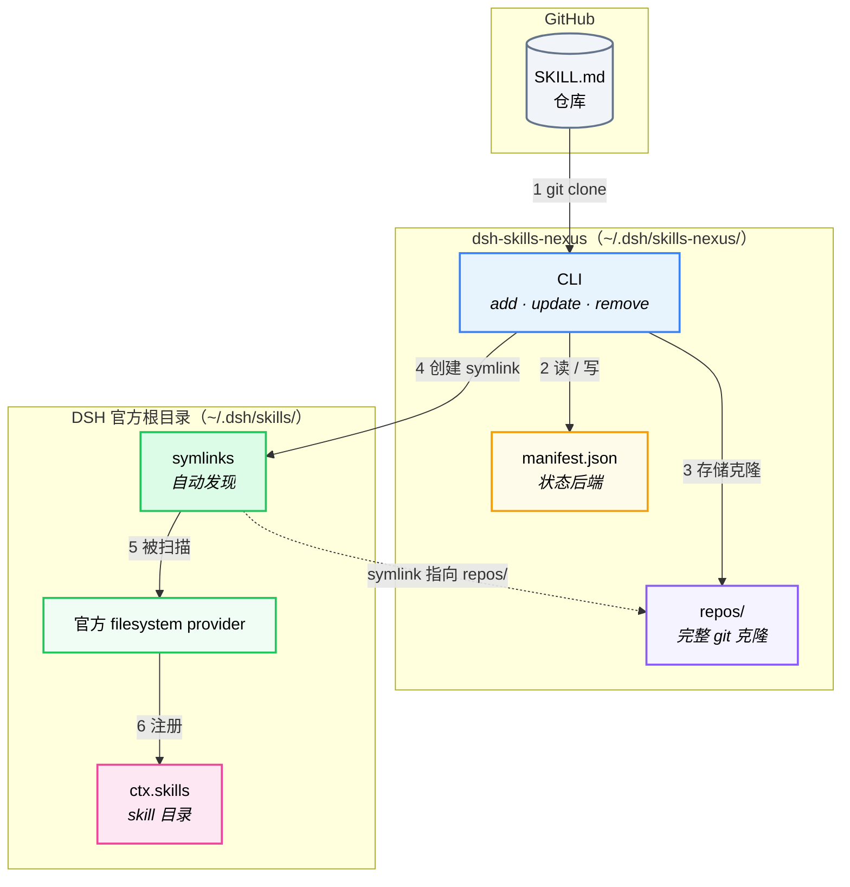

# dsh-skills-nexus

[](https://github.com/xiaxi626/dsh-skills-nexus/actions/workflows/ci.yml)


[English](README.md) | **中文**

⭐ **如果项目对你有帮助，欢迎 Star 支持！**

通用 DSH skill 适配器。**安装一次**，就可以把任意 GitHub 上的 `SKILL.md` 仓库注册为 DSH skill——一条命令添加一个。skill 仓库本身保持纯净：不需要 Cordis 插件代码，不需要 `package.json`，也不需要 `cordis.patch.yml`。

本项目通过 CLI 将 SKILL.md 仓库克隆到本地 `~/.dsh/skills-nexus/repos/` 目录，然后在 DSH 官方 skills 根目录（`~/.dsh/skills/`）中创建符号链接（symlink）。官方 filesystem provider 会自动发现、监听并加载这些 skill——不再需要自定义 provider，也不再需要在运行时扫描目录。

## 架构概览



- **CLI 管写入**：`add` / `update` / `remove` 等命令操作 git、写 `manifest.json`，并在 `~/.dsh/skills/` 中创建/删除 symlink
- **官方 provider 管读取**：DSH 内置的 filesystem provider 自动扫描 `~/.dsh/skills/`，发现 symlink 指向的 skill
- **两边解耦**：CLI 只管克隆和 symlink；发现和加载完全交给官方 provider

## 为什么需要它

`dsh plugin --profile <name> add "github:owner/repo"` 转发给 pnpm，且**只有声明了 `dsh.bundle.patch` 的包才会被激活为 profile layer**。一个只含 `SKILL.md` + `references/` + `scripts/` 的内容仓库没有 Cordis 封装，走不通这条路。`dsh-skills-nexus` 填补了这个缺口：

| 命令 | 安装的是什么 | 需要 `dsh.bundle.patch`？ |
|---|---|---|
| `dsh plugin add github:owner/dsh-skills-nexus` | nexus 本身（仅一次） | 是 |
| `dsh-skills-nexus add github:owner/any-skill` | 纯 SKILL.md 内容仓库 | **否** |

> **不确定自己的仓库该用哪个命令？** 请看
> **[nexus 与 `dsh plugin`——什么时候用哪个](docs/nexus-vs-plugin.zh-CN.md)**。
> 一句话版：仓库里有 `SKILL.md` → 用 nexus；是纯插件（`cordis.patch.yml` / `dsh.bundle.patch`，无 `SKILL.md`）→ 用 `dsh plugin`；两者都有 → 自己选（nexus = 要内容，plugin = 要代码）。

## 安装 nexus

```bash
dsh plugin --profile web add "github:xiaxi626/dsh-skills-nexus"
```

重启一次 profile。之后 `dsh-skills-nexus` CLI 命令就可用了。`lib/` 编译产物已随仓库提交，安装即用。

## 使用

```bash
# 注册一个 skill 仓库（克隆到 ~/.dsh/skills-nexus/repos/<name>/ 下）
dsh-skills-nexus add github:owner/repo
dsh-skills-nexus add github:owner/repo#dev          # 指定分支 / tag
dsh-skills-nexus add https://github.com/owner/repo
dsh-skills-nexus add owner/repo                     # 简写
dsh-skills-nexus add github:owner/repo --yes         # 跳过"包装型仓库？"确认
dsh-skills-nexus add github:owner/repo --subdir skills/foo   # 只安装集合仓库里的某个子目录

# 查看 / 维护
dsh-skills-nexus list                               # 列出所有已注册 skill（含安装的 commit、subdir、状态）
dsh-skills-nexus update [name]                      # 刷新（分支 pin 拉取；tag/commit pin 校验）
dsh-skills-nexus enable  <name>                     # 创建 symlink（默认开启）
dsh-skills-nexus disable <name>                     # 删除 symlink 但不删克隆
dsh-skills-nexus remove <name>                      # 删除克隆 + symlink + 注销
```

支持的仓库格式：`github:owner/repo[#ref]`、完整 `https://` URL（含 `/tree/<ref>/...` 子路径）、`git+https://`、`git@`/`ssh://`、以及裸写 `owner/repo` 简写。

`add` 会在注册前检查克隆下来的仓库类型：

- **纯 SKILL.md 仓库**：直接注册。
- **SKILL.md + DSH 薄包装层**：询问是否忽略包装层、按普通 SKILL.md 仓库管理。输入 `y` 继续，输入 `n` 中止并建议按 DSH 插件方式安装。使用 `--yes` 可跳过确认。
- **纯 DSH 插件（没有 SKILL.md）**：提示请按该仓库自己的 DSH 插件安装方式安装，不建议用 nexus 管理，然后退出，不注册。
- **两者都不是**：提示未找到 SKILL.md 或 DSH 插件标记，报错退出。
- **集合仓库**（`skills/<name>/SKILL.md` 布局，如 `trae-community/trae-skills`）：整个仓库安装时根目录没有可安装的 skill，nexus 会拒绝并提示改用 `--subdir <path>` 指定子目录；一次安装解析出超过 20 个 skill 时会弹确认提示（`--yes` 跳过）。

## SKILL.md 发现规则（每个克隆仓库内）

1. `<repoRoot>/SKILL.md` — 优先级最高；整个仓库作为单个 skill。
2. `<repoRoot>/<name>/SKILL.md` — 仓库按子目录打包多个 skill（仅单层，与官方 filesystem provider 一致；嵌套的 `**/SKILL.md` 被排除）。
3. `<repoRoot>/<name>.md` — 扁平 Markdown 文件（无配套资源）。

扁平扫描会跳过 `README.md` / `CHANGELOG.md` / `LICENSE.md`。

### 支持的 frontmatter 字段

必填：`name`、`description`。可选且被 provider 识别：
`disable-model-invocation`（布尔）、`user-invocable`（布尔）。其余字段
（`whenToUse`、`metadata` 等）会被解析并保留，但 nexus 不做进一步解释。

> **注意**：nexus 在安装时会归一化不合法的 frontmatter 名称（修正为 kebab-case），并补全缺失的 description，确保官方 provider 不会因为 frontmatter 有问题而静默跳过 skill。

## 文件系统布局

```
~/.dsh/
├── skills/                          # DSH 官方 skills 根目录（官方 provider 扫描这里）
│   ├── skill-a/        → symlink →  ~/.dsh/skills-nexus/repos/repo-a/
│   └── skill-b/        → symlink →  ~/.dsh/skills-nexus/repos/repo-b/skills/foo/
│
└── skills-nexus/
    ├── manifest.json                 # 状态后端：CLI 写
    └── repos/                        # 完整 git 克隆存放处
        ├── repo-a/                  # 完整 git 克隆（nexus 管理）
        │   ├── SKILL.md
        │   └── references/…
        └── repo-b/
            └── skills/
                └── foo/
                    └── SKILL.md
```

**为什么有两层目录？**

- `repos/` 是 nexus 的私有存储——所有 git 克隆都放在这里，保持原始结构不变。CLI 通过 git 对这些目录做 clone / pull / checkout 等操作。克隆由 nexus 管理：`add` / `update` 可能原地归一化 frontmatter（修正非法名称、补全缺失的 `description`），`update` 在拉取前会丢弃本地改动（有警告）——请勿手动编辑克隆。
- `~/.dsh/skills/` 是 DSH 官方的 skills 根目录——官方 filesystem provider 只扫描这一层。nexus 在这里为每个 skill 创建一个 symlink，指向 `repos/` 中的实际目录。这样官方 provider 就能自动发现所有 skill，无需自定义 provider。

`enable` / `disable` 就是创建/删除 symlink——轻量且原子化，克隆数据始终保留在 `repos/` 中。`remove` 则同时删除 symlink 和克隆目录。

可用 `DSH_HOME`（默认 `~/.dsh`）或 `DSH_SKILLS_NEXUS_HOME`（默认 `<DSH_HOME>/skills-nexus`）覆盖根目录。

## 卸载

分两个层级，按需选择：

### 卸载单个 skill

```bash
# 查看已注册的 skill
dsh-skills-nexus list

# 删除一个（删除 symlink、克隆目录并注销）
dsh-skills-nexus remove <skill-name>
```

下次 DSH 重载后该 skill 从目录中消失，不影响其他已注册的 skill。

### 卸载 nexus 本身

```bash
# 1. （可选）先删除所有已管理的 skill，清理 ~/.dsh/skills-nexus/ 目录
dsh-skills-nexus remove <name1>
dsh-skills-nexus remove <name2>
# ...

# 2. 从 DSH profile 中卸载插件
dsh plugin --profile web remove dsh-skills-nexus

# 3. （可选）删除残留状态
#    macOS / Linux:
rm -rf ~/.dsh/skills-nexus
#    Windows PowerShell:
# Remove-Item -Recurse -Force ~/.dsh/skills-nexus

# 4. （可选）删除本地测试目录
#    Windows PowerShell:
# Remove-Item -Recurse -Force dsh-skills-nexus
```

重启 DSH profile。`dsh-skills-nexus` CLI 及其所有 skill 都会被移除。

## 本地测试步骤

不需要推 GitHub、不需要发 npm，按以下五步在本机完整验证。

### 第一步：把项目编译出来

在 `dsh-skills-nexus/` 目录下：

```bash
cd dsh-skills-nexus
npm install
npm run build      # 生成 lib/ 目录
```

> 如果改了代码想先确认类型无误再编译，可以跑 `npm run typecheck`（只检查类型，不生成产物）。

### 第二步：创建本地 overlay

在项目根目录下新建 `overlay.yml`（注意：**不要提交到 git**，它是本地开发专用的）：

```yaml
# overlay.yml
- insert:
    - id: dsh-skills-nexus
      # Windows: '/C:/你的路径/dsh-skills-nexus/lib/index.js'
      # macOS:   '/Users/你的路径/dsh-skills-nexus/lib/index.js'
      # Linux:   '/home/你的路径/dsh-skills-nexus/lib/index.js'
      name: '/你的/绝对/路径/dsh-skills-nexus/lib/index.js'
```

> `name` 填 `lib/index.js` 的**绝对路径**。Windows 必须在盘符前加 `/`，例如 `'/C:/dev/dsh-skills-nexus/lib/index.js'`；macOS / Linux 直接用绝对路径，例如 `'/home/user/dsh-skills-nexus/lib/index.js'`。

**也可以用命令一键生成**（确保已 cd 到项目目录）：

**Windows (Git Bash / MINGW)：**

```bash
cat > overlay.yml <<EOF
- insert:
    - id: dsh-skills-nexus
      name: '/$(pwd -W)/lib/index.js'
EOF
```

> `pwd -W` 输出 Windows 风格绝对路径（如 `C:/Users/xxx/dsh-skills-nexus`），前面必须加 `/`，拼接后得到 `/C:/Users/xxx/dsh-skills-nexus/lib/index.js`。
> Node.js ESM loader 在 Windows 上不认裸 `C:/...` 路径（会被当成 `c:` 协议），必须写成 `/C:/...` 或 `file:///C:/...`。

**macOS / Linux：**

```bash
cat > overlay.yml <<EOF
- insert:
    - id: dsh-skills-nexus
      name: '$(pwd)/lib/index.js'
EOF
```

> `pwd` 输出 Unix 风格绝对路径（如 `/Users/xxx/dsh-skills-nexus`），本身已以 `/` 开头，拼接后得到 `/Users/xxx/dsh-skills-nexus/lib/index.js`。

执行后项目根目录会自动生成正确的 `overlay.yml`，路径自动填充。

### 第三步：用 patch 模式启动 DSH

```bash
npx @deepseek-ai/dsh web --patch overlay.yml
```

这会把 nexus 作为临时 layer 挂载进当前 profile，CLI 命令 `dsh-skills-nexus` 随之可用。**每次改了代码重新 `npm run build` 后，重启 DSH 生效。**

### 第四步：用 CLI 加一个 skill 测试

> **注意**：本地测试过程中**不要移动项目文件夹**。如果你在 `npm link` 之后移动了项目位置，再次 `npm link` 会报 `EEXIST: file already exists`——因为全局里还留着旧位置的链接。处理方法见下文。

另开一个终端：

```bash
# 先把 CLI 链到全局，方便直接用 dsh-skills-nexus 命令
cd dsh-skills-nexus
npm link

# 加一个真实的 skill 仓库试试
dsh-skills-nexus add github:xiaxi626/theme-port-skill

# 查看是否注册成功
dsh-skills-nexus list

# 检查官方根目录中是否创建了 symlink
ls -la ~/.dsh/skills/
```

**如果移动过文件夹，`npm link` 报 EEXIST 的处理方法：**

方案 A — 用 `--force` 直接覆盖（最简单，全平台通用）：

```bash
npm link --force
```

方案 B — 手动删除旧的全局链接，再重新链接：

**Git Bash：**

```bash
rm -f "$(npm prefix -g)/dsh-skills-nexus"
rm -f "$(npm prefix -g)/dsh-skills-nexus.cmd"
rm -f "$(npm prefix -g)/dsh-skills-nexus.ps1"
npm link
```

**Windows PowerShell：**

```powershell
Remove-Item -Force "$(npm prefix -g)\dsh-skills-nexus*"
npm link
```

> 用 `$(npm prefix -g)` 而不是 `~` 或硬编码路径，可以确保无论 Git Bash 中 `HOME` 环境变量是否正确配置，都能解析到正确的 npm 全局目录。

### 第五步：在 DSH 里验证

> **注意**：第三步用 `--patch` 启动的 DSH 进程，是在第四步加 skill **之前**就跑起来的，因此直接在原来的 DSH 界面里问「你有哪些 skill」是看不到新 skill 的——provider 还没扫描到它。
>
> **必须先停掉再重启**：回到第三步启动 DSH 的那个终端，按 `Ctrl+C` 停掉进程，然后重新执行一遍：
> ```bash
> npx @deepseek-ai/dsh web --patch overlay.yml
> ```
> 重启后 DSH 会重新加载 filesystem provider，此时它会扫描 `~/.dsh/skills/` 中的 symlink，发现刚通过 CLI 添加的 skill。

重启完成后，在 DSH 会话里问一句「你有哪些 skill」或类似触发目录查询的话，看 `theme-port-skill` 是否出现在 skill 列表里。

---

## 更轻的验证（不启动 DSH 也能测核心逻辑）

如果只想验证「clone + symlink 创建 + list」这条链路是否正常，不需要启动整个 DSH，直接用 CLI 即可：

```bash
# 加一个 skill
dsh-skills-nexus add github:xiaxi626/theme-port-skill

# 查看注册结果
dsh-skills-nexus list

# 检查 symlink 是否创建成功
ls -la ~/.dsh/skills/
```

> 如果 `list` 显示了预期的 skill、`ls -la` 显示了指向 `repos/` 目录的 symlink，说明整个 clone + symlink 链路正常。

---

## 工作原理

```
dsh-skills-nexus add github:owner/repo
   └─ git clone --depth 1 →  ~/.dsh/skills-nexus/repos/<name>/
   └─ 归一化 frontmatter     （修正不合法名称为 kebab-case，补全缺失的 description）
   └─ 创建 symlink        →  ~/.dsh/skills/<skill-name>/  →  指向 repos/<name>/
   └─ 追加条目              →  ~/.dsh/skills-nexus/manifest.json

DSH filesystem provider（官方内置）
   └─ 扫描 ~/.dsh/skills/ → 自动发现所有 symlink 指向的 skill
   └─ 读取每个 SKILL.md 的 frontmatter + body
```

关键设计点：

- **用 symlink 替代自定义 provider**：官方 filesystem provider 负责发现、文件监听和错误容错——不用维护自定义 provider 代码。
- **每个 skill 独立的 `resourceBase`**：每个 symlink 指向该 skill 自己的克隆目录，因此相对路径（`references/`、`scripts/`、`assets/`）能正确解析。
- **多 skill 仓库支持**：集合仓库为每个发现的 skill 创建一个 symlink——都展平在 `~/.dsh/skills/` 顶层，官方 provider 单层扫描即可发现。
- **安装时归一化**：修正不合法的 frontmatter 名称，补全缺失的 description，确保官方 provider 不会静默跳过 skill。
- **enable/disable 轻量**：只是创建/删除 symlink，克隆数据始终保留在 `repos/` 中。

## 项目结构

```
src/
├── index.ts          # Cordis 插件入口（apply 空实现，仅用于 dsh plugin add 安装）
├── link.ts           # symlink 管理（link/unlink/碰撞检测）
├── resolve.ts        # 解析克隆仓库中的 skill（previewSkills + isValidSkillName）
├── manifest.ts       # manifest.json 的读写/查找/增删
├── locator.ts        # 在克隆目录中定位 SKILL.md（3 种发现布局）
├── frontmatter.ts    # 基于 yaml 的 frontmatter 解析 + 归一化（normalizeSkillName / ensureDescription）
├── git.ts            # parseGitSpec / cloneRepo / pullRepo（execFile，无 shell）
├── paths.ts          # 官方 skills 根 / repos / manifest 路径常量
├── types.ts          # Manifest / SkillEntry 类型
├── repo-kind.ts      # 克隆仓库分类（纯内容 / 包装 / 插件 / 无法识别）
└── cli/
    ├── index.ts      # 命令分发
    ├── args.ts       # 轻量 argv 解析
    └── commands/     # add · list · update · remove · toggle
```

运行时依赖只有 `yaml`。`index.ts` 的 `apply()` 是空实现——不再注册自定义 provider，所有 skill 发现通过 symlink 交给官方 filesystem provider。

## 开发：测试与 CI

> **想端到端验证某个功能？**
> - [验证版本锁定功能（P0）](docs/verify-version-lock.zh-CN.md) ——
>   测试套件、分支快进、tag 固定点、漂移恢复、重复 add 保护。
> - [验证集合仓库支持（P1）](docs/verify-collection-support.zh-CN.md) ——
>   `--subdir` 按需安装、平铺 md 过滤、大集合防呆。
> 两者均为覆盖 Windows / Linux / macOS 的可直接复制的验证流程。

质量门禁，本地全部可跑：

```bash
npm run typecheck   # tsc --noEmit（strict）
npm run lint        # ESLint 9 + typescript-eslint（flat config）
npm test            # 单元测试——node:test + tsx，不引入额外测试框架
npm run build       # tsc → lib/
```

测试位于 `test/`，覆盖纯逻辑模块：

| 模块 | 测试文件 | 验证内容 |
|---|---|---|
| `src/git.ts` | `test/git.test.ts` | `parseGitSpec`（所有接受的仓库格式）、`repoSlug`、`sanitizeName` |
| `src/frontmatter.ts` | `test/frontmatter.test.ts` | frontmatter 与正文切分、坏 YAML、块标量、CRLF、`flag()` |
| `src/locator.ts` | `test/locator.test.ts` | 三种 SKILL.md 发现布局、跳过文件、隐藏目录 |
| `src/repo-kind.ts` | `test/repo-kind.test.ts` | 仓库分类：纯内容 / 包装 / 插件 / 无法识别 |
| `src/cli/args.ts` | `test/args.test.ts` | 极简 argv 解析器 |
| `src/manifest.ts` | `test/manifest.test.ts` | 在临时 `DSH_HOME` 上做 manifest 读写往返 |
| `src/resolve.ts` | `test/resolve.test.ts` | `previewSkills`（预览 skill）、`isValidSkillName` 校验 |

`npm run test:build` 把 `src/` + `test/` 编译到 `test-dist/`，可无 loader 直接跑
（`node --test test-dist/test/`），适合 tsx loader 不可用的环境。

CI（`.github/workflows/ci.yml`）在 push/PR 时于 Node 18/20/22 上运行：
typecheck、lint、单元测试、build，以及「已提交的 `lib/` 是否与最新源码一致」的校验
（发布包直接带 `lib/`，编译产物过期会导致发布内容与源码漂移）。

## 注意事项与限制

- **add 后是否立即可见**：新添加的 skill 是否立即出现在目录中，取决于 DSH 是否重新扫描了 `~/.dsh/skills/`。如果 profile 在 add 之前已启动，重载一下即可——官方 filesystem provider 会重新扫描 skills 根目录，拾取新创建的 symlink。
- **版本固定与更新**：用 `#分支名`、`#tag名` 或 `#commit-hash` 固定 ref。安装时 manifest 会记录实际解析到的 commit（`commit` 字段）——一个轻量锁，`list` 会显示它。`update` 只对**分支** pin 的 skill 做快进拉取（并打印 commit 变化）；**tag/commit** pin 的 skill 是固定点：只校验当前 checkout 是否仍等于 pin（漂移则自动恢复），不做 pull——被固定的版本永远不会静默漂移。不加 `#ref` 时，CLI 会通过 `git ls-remote --symref` 自动探测远程默认分支（探测失败回落到 `main`）。
- **仅用于 skill 内容仓库**：这不是 `dsh plugin add` 的替代品。如果仓库本身就有 `dsh.bundle.patch`，请用正常方式安装——nexus 是给那些没有封装的仓库用的。完整决策指南见 [nexus 与 `dsh plugin`——什么时候用哪个](docs/nexus-vs-plugin.zh-CN.md)。
- **集合仓库与 `--subdir`**：skill 藏在子目录的集合仓库用 `--subdir <path>` 按需安装——每次安装是一个独立条目、独立克隆（独立克隆设计，P1/P2 权衡见 [docs/subdir-design.md](docs/subdir-design.md)）。不带 `--subdir` 全量安装时，根目录无可用 skill 会被拒绝；超过 20 个 skill 会弹确认提示。
- **平铺 md 过滤**：没有 frontmatter `name` **且**没有 `description` 的平铺 `*.md` 不会被当作 skill——集合仓库的文档（`README.zh-CN.md`、`CONTRIBUTING.md`、`community-leaderboard.md` 等）永远不会被"假装安装"。发现阶段的跳过名单也按前缀模式覆盖 `readme*`、`contributing*`、`license*`、`changelog*`、`code-of-conduct*`、`security*`。
- **同名不消歧**：DSH 按名称索引 skill，后安装的同名 skill 会覆盖前者。用 `--name` 区分条目，或用 `--subdir` 只装需要的。enable/disable 按条目（即按安装的 subdir）生效，`remove` 删除整个条目的克隆及其所有 symlink。
- **skill 名校验**：DSH 要求 skill 名是小写 kebab-case（`[a-z0-9]+` 段，用单个 `-` 分隔）。frontmatter `name` 不合法（如 `CurriculumDesigner`）会导致 DSH 拒绝该 skill，因此 nexus 会在安装时归一化这类名称（转为 kebab-case），并在 `add` 时以 `⚠` 警告。
- **构建脚本**：由于 nexus 自己 clone 内容仓库（不走 pnpm），它完全绕开了 pnpm 的 `allowBuilds` 拦截。
- **Windows 符号链接**：在 Windows 上创建 symlink 需要开发者模式或管理员权限。如果 symlink 创建失败，skill 不会出现在目录中——请在 Windows 设置中启用开发者模式，或以管理员身份运行。

## 许可证

MIT
