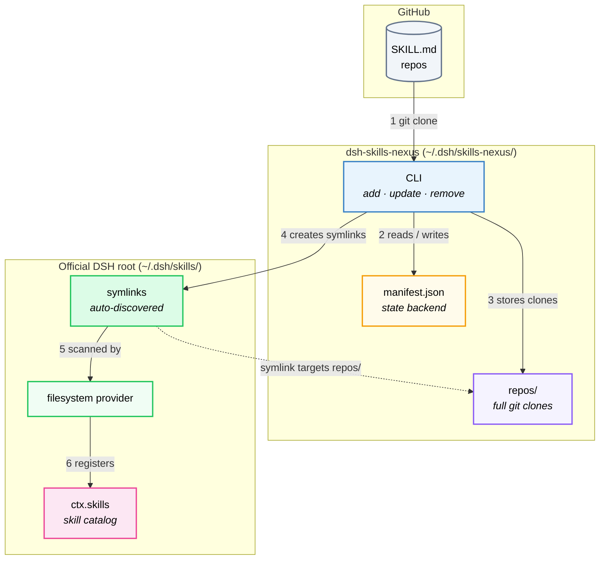

# Architecture

> [中文](ARCHITECTURE.zh-CN.md) | **English**

How dsh-skills-nexus works internally: the data flow, directory layout,
SKILL.md discovery rules, and key design decisions.

## Overview



- **CLI writes**: `add` / `update` / `remove` commands operate git, update `manifest.json`, and create/remove symlinks in `~/.dsh/skills/`
- **Official provider reads**: the built-in filesystem provider scans `~/.dsh/skills/` and discovers skills through symlinks
- **Decoupled**: CLI only manages clones and symlinks; discovery and serving are entirely handled by the official provider

## How it works

```
dsh-skills-nexus add github:owner/repo
   └─ git clone --depth 1 →  ~/.dsh/skills-nexus/repos/<name>/
   └─ normalize frontmatter  (fix invalid names to kebab-case, add missing description)
   └─ create symlink     →  ~/.dsh/skills/<skill-name>/  →  points to repos/<name>/
   └─ append entry       →  ~/.dsh/skills-nexus/manifest.json

DSH filesystem provider (official, built-in)
   └─ scans ~/.dsh/skills/ → discovers all symlinked skills automatically
   └─ reads each SKILL.md's frontmatter + body
```

Key design points:

- **Symlinks instead of a custom provider**: the official filesystem provider
  handles discovery, file watching, and error tolerance — no custom provider
  code to maintain.
- **Per-skill `resourceBase`**: each symlink points at that skill's own clone
  directory, so relative paths (`references/`, `scripts/`, `assets/`) resolve
  correctly.
- **Multi-skill repos work**: collection repos create one symlink per
  discovered skill — all visible at the top level of `~/.dsh/skills/`, matching
  the official provider's single-level scan.
- **Install-time normalization**: invalid frontmatter names are fixed and
  missing descriptions are filled in, so the official provider never silently
  skips a skill.
- **Lightweight enable/disable**: just create/remove symlinks — clone data
  always stays in `repos/`.

## SKILL.md discovery (per cloned repo)

1. `<repoRoot>/SKILL.md` — authoritative; repo treated as a single skill.
2. `<repoRoot>/<name>/SKILL.md` — repo bundles one skill per subdirectory (single-level only, matching the official filesystem provider; nested `**/SKILL.md` is excluded).
3. `<repoRoot>/<name>.md` — flat markdown (no bundled resources).

`README.md` / `CHANGELOG.md` / `LICENSE.md` are skipped in the flat scan.

### Frontmatter fields honored

Required: `name`, `description`. Optional, respected by the provider:
`disable-model-invocation` (bool), `user-invocable` (bool). Any other fields
(`whenToUse`, `metadata`, …) are parsed and preserved.

> **Note**: nexus normalizes invalid frontmatter names at install time (converted
> to kebab-case) and fills in missing descriptions, so the official provider
> never silently skips a skill due to bad frontmatter.

## Filesystem layout

```
~/.dsh/
├── skills/                          # official DSH skills root (provider scans here)
│   ├── skill-a/        → symlink →  ~/.dsh/skills-nexus/repos/repo-a/
│   └── skill-b/        → symlink →  ~/.dsh/skills-nexus/repos/repo-b/skills/foo/
│
└── skills-nexus/
    ├── manifest.json                 # state backend: CLI writes
    └── repos/                        # full git clones live here
        ├── repo-a/                  # full git clone (nexus-managed)
        │   ├── SKILL.md
        │   └── references/…
        └── repo-b/
            └── skills/
                └── foo/
                    └── SKILL.md
```

**Why two directory layers?**

- `repos/` is nexus's private storage — all git clones live here, keeping their original structure intact. The CLI uses git to clone / pull / checkout these directories. Clones are nexus-managed: `add` / `update` may normalize frontmatter in place (fix invalid names, add missing `description`), and `update` discards local changes before pulling (with a warning) — do not edit clones by hand.
- `~/.dsh/skills/` is the official DSH skills root — the official filesystem provider only scans this level. Nexus creates one symlink per skill here, pointing to the actual directory in `repos/`. This way the official provider discovers all skills automatically, with no custom provider needed.

`enable` / `disable` simply create/remove symlinks — lightweight and atomic, clone data always stays in `repos/`. `remove` deletes both the symlink and the clone directory.

Override the root with `DSH_HOME` (defaults to `~/.dsh`) or
`DSH_SKILLS_NEXUS_HOME` (defaults to `<DSH_HOME>/skills-nexus`).
