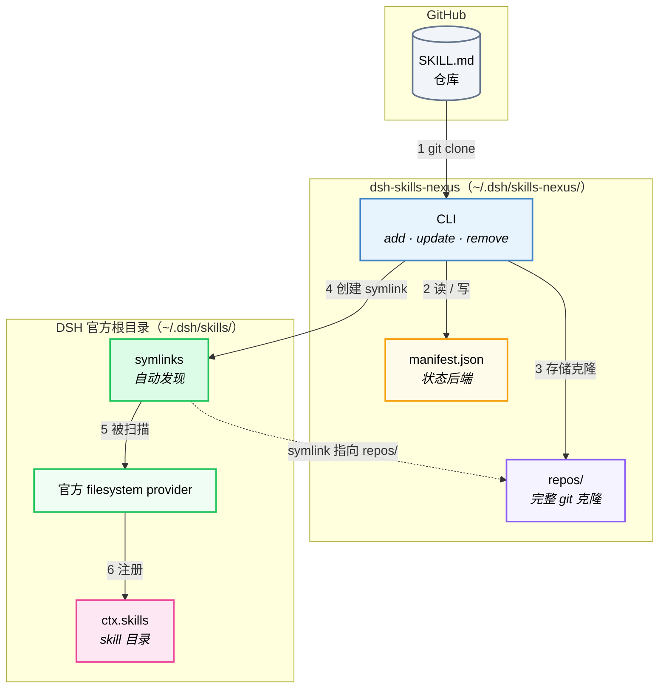

# 架构

[English](ARCHITECTURE.md) | **中文**

dsh-skills-nexus 的内部工作原理：数据流、目录布局、SKILL.md 发现规则和关键设计决策。

## 概览



- **CLI 管写入**：`add` / `update` / `remove` 等命令操作 git、写 `manifest.json`，并在 `~/.dsh/skills/` 中创建/删除 symlink
- **官方 provider 管读取**：DSH 内置的 filesystem provider 自动扫描 `~/.dsh/skills/`，发现 symlink 指向的 skill
- **两边解耦**：CLI 只管克隆和 symlink；发现和加载完全交给官方 provider

## 工作原理

```
dsh-skills-nexus add github:owner/repo
   └─ git clone --depth 1 →  ~/.dsh/skills-nexus/repos/<name>/
   └─ 归一化 frontmatter     （修正不合法名称为 kebab-case，补全缺失的 description）
   └─ 创建 symlink        →  ~/.dsh/skills/<skill-name>/  →  指向 repos/<name>/
   └─ 追加条目              →  ~/.dsh/skills-nexus/manifest.json

DSH filesystem provider（官方内置）
   └─ 扫描 ~/.dsh/skills/ → 自动发现所有 symlink 指向的 skill
   └─ 读取每个 SKILL.md 的 frontmatter + body
```

关键设计点：

- **用 symlink 替代自定义 provider**：官方 filesystem provider 负责发现、文件监听和错误容错——不用维护自定义 provider 代码。
- **每个 skill 独立的 `resourceBase`**：每个 symlink 指向该 skill 自己的克隆目录，因此相对路径（`references/`、`scripts/`、`assets/`）能正确解析。
- **多 skill 仓库支持**：集合仓库为每个发现的 skill 创建一个 symlink——都展平在 `~/.dsh/skills/` 顶层，官方 provider 单层扫描即可发现。
- **安装时归一化**：修正不合法的 frontmatter 名称，补全缺失的 description，确保官方 provider 不会静默跳过 skill。
- **enable/disable 轻量**：只是创建/删除 symlink，克隆数据始终保留在 `repos/` 中。

## SKILL.md 发现规则（每个克隆仓库内）

1. `<repoRoot>/SKILL.md` — 优先级最高；整个仓库作为单个 skill。
2. `<repoRoot>/<name>/SKILL.md` — 仓库按子目录打包多个 skill（仅单层，与官方 filesystem provider 一致；嵌套的 `**/SKILL.md` 被排除）。
3. `<repoRoot>/<name>.md` — 扁平 Markdown 文件（无配套资源）。

扁平扫描会跳过 `README.md` / `CHANGELOG.md` / `LICENSE.md`。

### 支持的 frontmatter 字段

必填：`name`、`description`。可选且被 provider 识别：
`disable-model-invocation`（布尔）、`user-invocable`（布尔）。其余字段
（`whenToUse`、`metadata` 等）会被解析并保留，但 nexus 不做进一步解释。

> **注意**：nexus 在安装时会归一化不合法的 frontmatter 名称（修正为 kebab-case），并补全缺失的 description，确保官方 provider 不会因为 frontmatter 有问题而静默跳过 skill。

## 文件系统布局

```
~/.dsh/
├── skills/                          # DSH 官方 skills 根目录（官方 provider 扫描这里）
│   ├── skill-a/        → symlink →  ~/.dsh/skills-nexus/repos/repo-a/
│   └── skill-b/        → symlink →  ~/.dsh/skills-nexus/repos/repo-b/skills/foo/
│
└── skills-nexus/
    ├── manifest.json                 # 状态后端：CLI 写
    └── repos/                        # 完整 git 克隆存放处
        ├── repo-a/                  # 完整 git 克隆（nexus 管理）
        │   ├── SKILL.md
        │   └── references/…
        └── repo-b/
            └── skills/
                └── foo/
                    └── SKILL.md
```

**为什么有两层目录？**

- `repos/` 是 nexus 的私有存储——所有 git 克隆都放在这里，保持原始结构不变。CLI 通过 git 对这些目录做 clone / pull / checkout 等操作。克隆由 nexus 管理：`add` / `update` 可能原地归一化 frontmatter（修正非法名称、补全缺失的 `description`），`update` 在拉取前会丢弃本地改动（有警告）——请勿手动编辑克隆。
- `~/.dsh/skills/` 是 DSH 官方的 skills 根目录——官方 filesystem provider 只扫描这一层。nexus 在这里为每个 skill 创建一个 symlink，指向 `repos/` 中的实际目录。这样官方 provider 就能自动发现所有 skill，无需自定义 provider。

`enable` / `disable` 就是创建/删除 symlink——轻量且原子化，克隆数据始终保留在 `repos/` 中。`remove` 则同时删除 symlink 和克隆目录。

可用 `DSH_HOME`（默认 `~/.dsh`）或 `DSH_SKILLS_NEXUS_HOME`（默认 `<DSH_HOME>/skills-nexus`）覆盖根目录。
