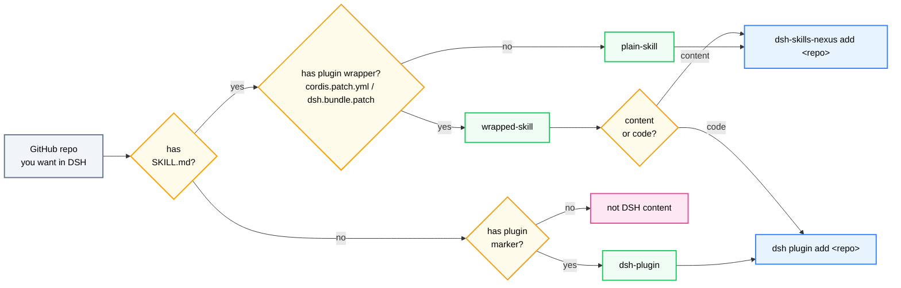

# dsh-skills-nexus vs `dsh plugin` — which one do I use?

Two commands both "install" GitHub repos into DSH, which is confusing. Here is
the entire difference in one sentence:

> **`dsh plugin add` installs an npm package that *runs* inside DSH.**
> **`dsh-skills-nexus add` git-clones *content* that DSH reads.**

Everything else follows from that.

---

## The two tools

| | `dsh plugin add` | `dsh-skills-nexus add` |
|---|---|---|
| What happens | pnpm installs the package into the profile's `node_modules` | `git clone --depth 1` into `~/.dsh/skills-nexus/repos/<name>/` |
| Repo must contain | `package.json` declaring `dsh.bundle.patch` (and/or `cordis.patch.yml`) | nothing special — just `SKILL.md` content |
| Runs code in DSH? | **Yes** — it's a real Cordis plugin (can register providers, hooks, layers) | **No** — a CLI tool that clones repos and creates symlinks; the official filesystem provider serves the skill bodies |
| How updates work | `dsh plugin update` (pnpm) | `dsh-skills-nexus update` (git pull) |
| Repo's build scripts | may run during install (pnpm `allowBuilds`) | never run — nexus clones content and executes nothing |
| Skills per repo | one package = one plugin | one clone → **N skills** (subdir bundles, flat `.md`) |
| Ref pinning | npm semver | git branch / tag / commit (`#ref`) |
| What it can't do | install content-only repos (no `dsh.bundle.patch` → pnpm won't activate them) | install pure plugins (it refuses) or run plugin code |

---

## Decide by what the repo contains

When you run `dsh-skills-nexus add <repo>`, nexus classifies the clone first
(`src/repo-kind.ts`). The same classification is the decision table:

| Repo contains | Kind | Use | Why |
|---|---|---|---|
| `SKILL.md` (or flat `*.md`), no wrapper | **plain-skill** | **nexus** | `dsh plugin` cannot activate it — there is no `dsh.bundle.patch` to latch onto |
| Plugin marker (`cordis.patch.yml` / `dsh.bundle.patch`), no `SKILL.md` | **dsh-plugin** | **`dsh plugin`** | it is a real plugin; nexus will refuse (it prints the plugin-install hint and exits) |
| `SKILL.md` **and** a plugin wrapper | **wrapped-skill** | **your call** (see below) | the repo ships both a plugin layer and content |
| Neither | **unknown** | neither | not DSH content — nexus errors, `dsh plugin` has no bundle to activate |

### Why would a repo ship *both*? (the wrapped-skill case)

Publishing a skill as **content** (`SKILL.md` + `references/`) and publishing a
**plugin** (code that runs inside DSH) are two different channels. Most repos
use exactly one:

- `SKILL.md` only → **no choice**: only nexus can install it (`dsh plugin`
  cannot activate a repo without `dsh.bundle.patch`).
- plugin marker only → **no choice**: only `dsh plugin` (nexus refuses).

Some authors ship **both** in one repo so it can be installed either way.
Nexus classifies those as *wrapped-skill* and asks which channel you want —
that is the only case where a choice exists.

What does "the plugin's behavior" mean concretely? Installed as a plugin, the
wrapper's code runs inside the DSH process — it can register a custom provider
that assembles skills dynamically, hook the DSH lifecycle, or integrate with
other DSH features. A `SKILL.md` is static text with attached resources; the
wrapper can behave programmatically. If the wrapper is just a thin shell
(most are), the content channel gives you everything; if it carries real
logic, the plugin channel is what the author intended for that logic.

### Wrapped repos: nexus or plugin?

Ask yourself what you actually want from the repo:

- **You want the content as skills** (the wrapper is just how the author
  published it) → use **nexus**. Answer `y` to the prompt (or `--yes`), and the
  wrapper is ignored. You get the `SKILL.md` files as skills, with
  `references/`/`scripts/` resolving correctly.
- **You want the plugin's behavior** (custom providers, runtime logic that a
  content file cannot express) → use **`dsh plugin`**. Answer `n` to the prompt
  (nexus aborts and prints the `dsh plugin --profile <name> add "<repo>"`
  hint), or skip nexus entirely.
- Not sure? Use **nexus** first — it is read-only and reversible. If the skill
  shows up and works, you are done. If you later miss plugin behavior, remove
  it (`dsh-skills-nexus remove <name>`) and install as a plugin.

---

## Quick flow

---

## Examples

- `github:owner/skill-repo` with just `SKILL.md` + `references/` →
  `dsh-skills-nexus add github:owner/skill-repo`
- A repo that is only `package.json` + `cordis.patch.yml` →
  `dsh plugin --profile <name> add "github:owner/plugin"`
- A skill collection repo bundling `alpha/SKILL.md`, `beta/SKILL.md`, plus
  flat `notes.md` → `dsh-skills-nexus add …` — all three surface as skills
- A repo with both `SKILL.md` and `cordis.patch.yml` →
  `dsh-skills-nexus add github:owner/wrapped` (answer `y`) **or**
  `dsh plugin … add` (if you need the wrapper code)
- The nexus itself → `dsh plugin --profile <name> add "github:xiaxi626/dsh-skills-nexus"`
  (it declares `dsh.bundle.patch` — a plugin installs the plugin, then nexus
  installs the skills)

---

## FAQ

**`dsh-skills-nexus add` said "this appears to be a DSH plugin".**
The repo has a plugin marker and no `SKILL.md`. Use that repo's own install
instructions — normally `dsh plugin --profile <name> add "<repo>"`.

**`dsh-skills-nexus add` said "no SKILL.md and no DSH plugin marker".**
The repo is neither. Nothing to install — both tools will refuse.

**`dsh plugin add` failed with something about `dsh.bundle.patch`.**
The repo is not an installable profile layer. If it contains `SKILL.md`, use
nexus instead.

**I picked nexus for a wrapped repo. What did I give up?**
The wrapper code never runs. Skills are served from the `SKILL.md` files only.
If the wrapper adds behavior beyond content, you will not get it.

**Can I run both on the same repo?**
Not meaningfully. Nexus refuses pure plugins; for wrapped repos, installing via
both routes would register the same content twice (as a plugin *and* as
skills). Pick one.

**Is my `SKILL.md` repo at risk from nexus?**
No. Nexus never executes anything from the clone — it only reads `SKILL.md`
and friends. It also never runs the repo's build/install scripts.
