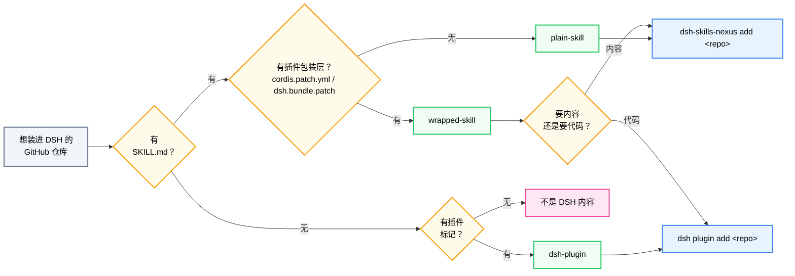

# dsh-skills-nexus 与 `dsh plugin` —— 什么时候用哪个？

有两条命令都能把 GitHub 仓库"装进"DSH，容易让人困惑。核心区别一句话：

> **`dsh plugin add` 安装的是一个会在 DSH 里*运行*的 npm 包；**
> **`dsh-skills-nexus add` 克隆的是 DSH 只*读取*的内容。**

其余一切都由此而来。

---

## 两种工具

| | `dsh plugin add` | `dsh-skills-nexus add` |
|---|---|---|
| 做了什么 | pnpm 把包安装进 profile 的 `node_modules` | `git clone --depth 1` 到 `~/.dsh/skills-nexus/repos/<name>/` |
| 仓库需要什么 | `package.json` 里声明 `dsh.bundle.patch`（和/或 `cordis.patch.yml`） | 什么都不用——只要有 `SKILL.md` 内容 |
| 会在 DSH 里跑代码吗？ | **会**——是真正的 Cordis 插件（可注册 provider、钩子、layer） | **不会**——是 CLI 工具，克隆仓库并创建 symlink；官方 filesystem provider 提供 SKILL.md 正文 |
| 怎么更新 | `dsh plugin update`（pnpm） | `dsh-skills-nexus update`（git pull） |
| 仓库的构建脚本 | 安装时可能执行（pnpm `allowBuilds`） | 永不执行——nexus 只克隆内容，不运行任何东西 |
| 一个仓库能出几个 skill | 一个包 = 一个插件 | 一个克隆 → **N 个 skill**（子目录 bundle、平铺 `.md`） |
| 版本固定 | npm semver | git 分支 / tag / commit（`#ref`） |
| 做不到什么 | 装不了纯内容仓库（没有 `dsh.bundle.patch`，pnpm 不会激活） | 装不了纯插件（会拒绝），也不能运行插件代码 |

---

## 按仓库内容决定

执行 `dsh-skills-nexus add <repo>` 时，nexus 会先对克隆做仓库分类（`src/repo-kind.ts`）。这个分类就是决策表：

| 仓库内容 | 分类 | 用哪个 | 为什么 |
|---|---|---|---|
| 有 `SKILL.md`（或平铺 `*.md`），无包装层 | **plain-skill** | **nexus** | `dsh plugin` 无法激活它——没有 `dsh.bundle.patch` 可挂载 |
| 有插件标记（`cordis.patch.yml` / `dsh.bundle.patch`），无 `SKILL.md` | **dsh-plugin** | **`dsh plugin`** | 它是真正的插件；nexus 会拒绝（打印插件安装提示后退出） |
| 既有 `SKILL.md` 又有插件包装层 | **wrapped-skill** | **看情况**（见下） | 仓库同时带插件层和内容 |
| 两者都没有 | **unknown** | 都不用 | 不是 DSH 内容——nexus 报错，`dsh plugin` 也没有 bundle 可激活 |

### 为什么会存在"既有又有"的仓库？（wrapped-skill 的情况）

「发**内容**」（`SKILL.md` + `references/`）和「发**插件**」（在 DSH 里运行的代码）是两条发布通道，绝大多数仓库只用其中一条：

- 只有 `SKILL.md` → **没得选**：只有 nexus 能装（没有 `dsh.bundle.patch`，`dsh plugin` 激活不了）。
- 只有插件标记 → **没得选**：只能 `dsh plugin`（nexus 会拒绝）。

少数作者会把**两条通道都留在一个仓库里**，方便用户任选安装方式。nexus 把这类仓库分类为 `wrapped-skill`，克隆后问你要走哪条通道——**这是唯一存在选择的场景**。

"插件的运行行为"具体指什么？按插件安装时，包装层代码会在 DSH 进程内运行——它可以注册自定义 provider 动态组装 skill、挂钩 DSH 生命周期、或集成其他 DSH 能力。而 `SKILL.md` 只是静态文本加附属资源，表达不了程序化行为。如果包装层只是薄壳（大多数情况），内容通道就够用；如果包装层有真实逻辑，插件通道才是作者为那段逻辑准备的。

### 包装型仓库：nexus 还是 plugin？

问自己到底想要这个仓库的什么：

- **想要内容当 skill 用**（包装层只是作者的发布方式）→ 用 **nexus**。提示时回答 `y`（或直接 `--yes`），包装层会被忽略，`SKILL.md` 会成为 skill，`references/`/`scripts/` 相对路径照常解析。
- **想要插件的运行行为**（自定义 provider、内容文件表达不了的运行时逻辑）→ 用 **`dsh plugin`**。提示时回答 `n`（nexus 中止并打印 `dsh plugin --profile <name> add "<repo>"` 提示），或者干脆不经过 nexus。
- 拿不准？**先试 nexus**——它只读、可逆。skill 正常出现并可用就完事；以后缺插件行为，`dsh-skills-nexus remove <name>` 删掉再按插件装。

---

## 快速流程图

---

## 例子

- `github:owner/skill-repo`，只有 `SKILL.md` + `references/` →
  `dsh-skills-nexus add github:owner/skill-repo`
- 只有 `package.json` + `cordis.patch.yml` 的仓库 →
  `dsh plugin --profile <name> add "github:owner/plugin"`
- 技能合集仓库：`alpha/SKILL.md`、`beta/SKILL.md` 加平铺 `notes.md` →
  `dsh-skills-nexus add …`，三个都会成为 skill
- 既有 `SKILL.md` 又有 `cordis.patch.yml` →
  `dsh-skills-nexus add github:owner/wrapped`（回答 `y`）**或**
  `dsh plugin … add`（需要包装层代码时）
- nexus 本身 → `dsh plugin --profile <name> add "github:xiaxi626/dsh-skills-nexus"`
  （它声明了 `dsh.bundle.patch`——插件装插件，nexus 装 skill）

---

## 常见问题

**`dsh-skills-nexus add` 提示"这看起来是 DSH 插件"。**
仓库有插件标记但没有 `SKILL.md`。按该仓库自己的安装说明操作——通常是 `dsh plugin --profile <name> add "<repo>"`。

**`dsh-skills-nexus add` 提示"没有 SKILL.md 也没有 DSH 插件标记"。**
仓库两者都不是，没东西可装——两个工具都会拒绝。

**`dsh plugin add` 报错提到 `dsh.bundle.patch`。**
该仓库不是可安装的 profile layer。如果里面有 `SKILL.md`，改用 nexus。

**我给包装型仓库选了 nexus，放弃了什么？**
包装层代码不会运行，skill 只来自 `SKILL.md` 文件。如果包装层有内容之外的行为，你拿不到。

**同一个仓库能两个都装吗？**
没意义。nexus 拒绝纯插件；包装型仓库两条路都装会把同一份内容注册两遍（既是插件又是 skill）。二选一。

**nexus 会给我的 `SKILL.md` 仓库带来风险吗？**
不会。nexus 从不执行克隆里的任何东西——只读取 `SKILL.md` 等文件，也从不运行仓库的构建/安装脚本。
